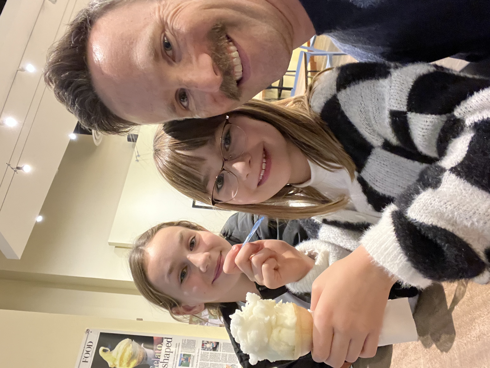
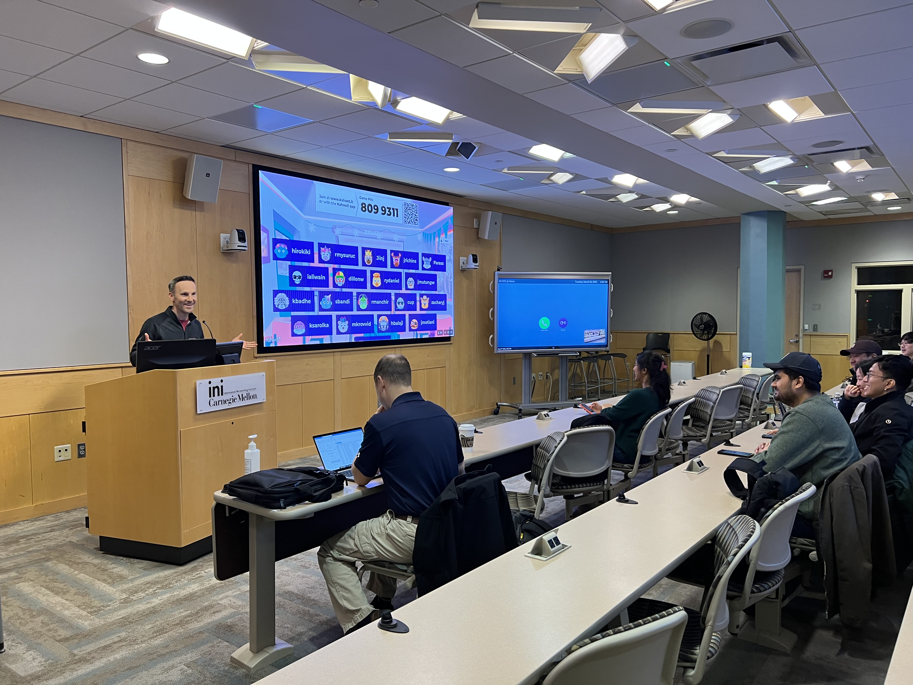
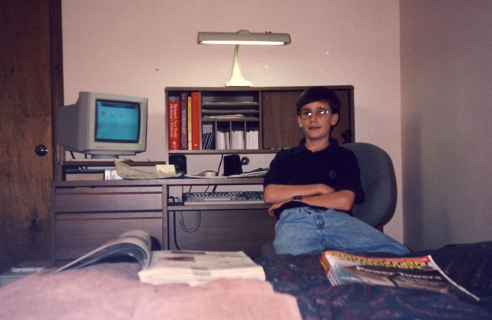
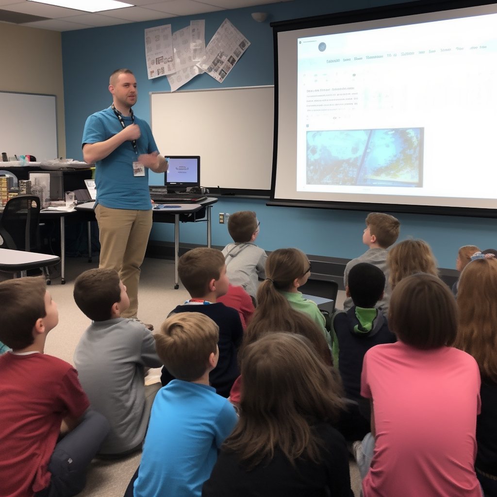

<!-- .slide: data-background-image="media/hwes-mural.jpg" style="margin-top:5em; background-color: rgba(36,23,52,.75)" -->
## Career Day!

<!-- .slide: data-background-gradient="linear-gradient(to top, #241734, #60447F)" -->
## Who am I?

<!-- .slide: data-background-gradient="linear-gradient(to top, #241734, #60447F)" -->
My name is **Matt Kaar**.

I am Izzy and Gwen's dad. &#128104;&#127995;
<!-- .element: class="fragment" -->

<!-- .slide: data-auto-animate data-background-gradient="linear-gradient(to top, #241734, #60447F)" -->

<!-- .slide: data-auto-animate data-background-gradient="linear-gradient(to top, #241734, #60447F)" -->

<!-- .slide: data-auto-animate data-background-gradient="linear-gradient(to top, #241734, #60447F)" -->
Before we get started&hellip;

<!-- .slide: data-auto-animate data-background-gradient="linear-gradient(to top, #241734, #60447F)" -->
Before we get started&hellip;

## &#10067; &#10067; &#10067; &#10067; &#10067;

## ASK QUESTIONS!

## &#10067; &#10067; &#10067; &#10067; &#10067;

<!-- .slide: data-background-gradient="linear-gradient(to top, #241734, #60447F)" -->
What is my career?

<!-- .slide: data-background-image="media/cmu.png" -->

<!-- .slide: data-auto-animate data-background-gradient="linear-gradient(to top, #241734, #60447F)" -->
I help **build** cybersecurity competitions.

<!-- .slide: data-auto-animate data-background-gradient="linear-gradient(to top, #241734, #60447F)" -->
<video data-autoplay controls data-src="media/prescup-intro.mp4"></video>

I help **build** cybersecurity competitions.

<!-- .slide: data-background-gradient="linear-gradient(to top, #241734, #60447F)" -->

President's Cup Cybersecurity Competition

<!-- .slide: data-background-gradient="linear-gradient(to top, #241734, #60447F)" -->
<video data-autoplay loop controls data-src="media/pc4-video-game.mp4"></video>

And we built a [video game](https://github.com/cmu-sei/cubespace) for the final day.

<!-- .slide: data-background-gradient="linear-gradient(to top, #241734, #60447F)" -->
Next up&hellip;

<!-- .slide: data-background-gradient="linear-gradient(to top, #241734, #60447F)" -->

I **teach** a college class.

<!-- .slide: data-auto-animate data-background-gradient="linear-gradient(to top, #241734, #60447F)" -->
Teaching [**applied cybersecurity**](https://www.andrew.cmu.edu/course/14-761/syllabus/) for five years.

Each class has **30-40** students.
<!-- .element: class="fragment" -->

Fly to **Pittsburgh** two nights every other week. &#9992;&#65039;
<!-- .element: class="fragment" -->

<!-- .slide: data-auto-animate data-background-gradient="linear-gradient(to top, #241734, #60447F)" -->

Fly to **Pittsburgh** two nights every other week. &#9992;&#65039;

<!-- .slide: data-background-gradient="linear-gradient(to top, #241734, #60447F)" -->
And last _(but not least)_&hellip;

<!-- .slide: data-background-gradient="linear-gradient(to top, #241734, #60447F)" -->

I **review** graduate school applications.

<!-- .slide: data-background-gradient="linear-gradient(to top, #241734, #60447F)" -->
Read **100+** applications each year

Look at school grades, essays and _videos_ &#127909;
<!-- .element: class="fragment" -->

And we use [**Duolingo**](https://englishtest.duolingo.com/applicants) to see if you understand English.
<!-- .element: class="fragment" -->

<!-- .slide: data-auto-animate data-background-gradient="linear-gradient(to top, #241734, #60447F)" -->
What was I doing in elementary school?

<!-- .slide: data-auto-animate data-background-gradient="linear-gradient(to top, #241734, #60447F)" -->

What was I doing in elementary school?

<!-- .slide: data-background-video="media/computer-disassemble.mp4" -->

<!-- .slide: data-background-gradient="linear-gradient(to top, #241734, #60447F)" -->
Fast forward to today &#9193;

<!-- .slide: data-background-image="media/my-desk.jpg" -->

<!-- .slide: data-background-gradient="linear-gradient(to top, #241734, #60447F)" -->
And I have lots of Zoom meetings.

<!-- .slide: data-background-image="media/zoom-team.png" -->

<!-- .slide: data-auto-animate data-background-gradient="linear-gradient(to top, #241734, #60447F)" -->
One more thing&hellip;

<!-- .slide: data-auto-animate data-background-gradient="linear-gradient(to top, #241734, #60447F)" -->
One more thing&hellip;

Let's talk about _passwords_.

<!-- .slide: data-background-gradient="linear-gradient(to top, #241734, #60447F)" -->

Imagine you're signing up for _TockTick_, a video sharing app where all videos play backwards. &#9194;

You need to choose a good **password**, what would you pick?
<!-- .element: style="background-color: rgb(228,107,50)" class="fragment" -->

<!-- .slide: data-background-image="media/password-table.png" data-background-size="contain" -->

<!-- .slide: data-background-gradient="linear-gradient(to top, #241734, #60447F)" -->
### Password Tips

Use a **password manager**.
<!-- .element: class="fragment" -->

Use a **different password** for each site/app.
<!-- .element: class="fragment" -->

Pick a password at least **12 characters** or **4 words** long.
<!-- .element: class="fragment" -->

<!-- .slide: data-background-gradient="linear-gradient(to top, #241734, #60447F)" -->

## Thank you!
